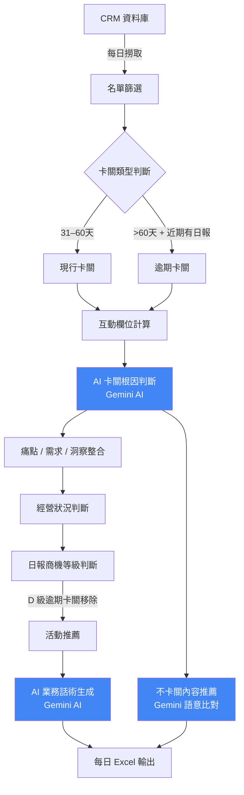
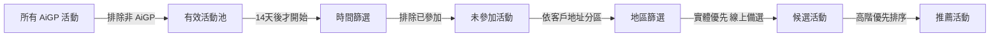
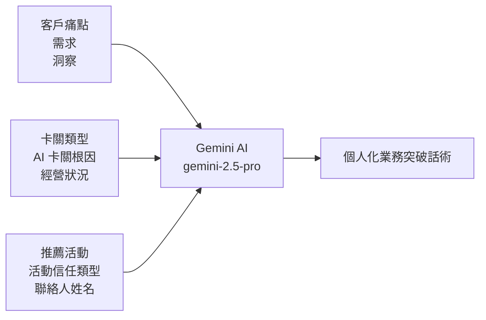

# AiGP 卡關商機分析系統

> 自動從 CRM 撈取卡關商機 → AI 分析卡關原因 → 生成個人化業務話術 → 推薦最適合的活動邀約

---

## 系統效益

| 指標 | 數字 |
|------|------|
| 每日自動分析筆數 | ~220 筆商機 |
| 需要邀約活動比例 | 97%（213/219） |
| AI 分析執行時間 | 5–8 分鐘 |
| 快取命中後執行時間 | < 1 分鐘 |

---

## 流程總覽



---

## 卡關分析邏輯

### 兩種卡關類型

| 類型 | 條件 |
|------|------|
| **現行卡關** | 商機建立距今 31–60 天（含 AiGP、老客、尚未升等） |
| **逾期卡關** | 商機建立距今 > 60 天 + 近 90 天有業務日報 + 日報等級非 D 級 |

### AI 八大卡關根因（可多選）

由 Gemini 綜合客戶互動與痛點/需求/洞察資料，判斷卡關主因：

| 根因類型 | 定義 |
|---------|------|
| 預算/成本疑慮 | 客戶認同方案但卡在價格、預算週期或 ROI 說服力不足 |
| 決策層未參與 | 目前僅接觸到基層/中階窗口，尚未觸及有決策權的人 |
| 技術驗證中 | 客戶要求先看 Demo、POC 或實際運作證明才敢往下談 |
| 需求尚未聚焦 | 客戶還在探索階段，痛點模糊、沒有明確要解決的問題 |
| 競品/市場觀望 | 客戶正在比較其他廠商方案，或在觀望市場趨勢再決定 |
| 內部流程延遲 | 客戶內部審批、跨部門協調或組織調整導致進度卡住 |
| 信任尚待建立 | 客戶對廠商/方案的可靠度、實績還存疑，需要案例佐證 |
| 方案未完整呈現 | 業務尚未把完整解決方案/效益具體說明給客戶聽 |

### 經營狀況判斷

| 最後日報距今 | 狀況 |
|-------------|------|
| ≤ 7 天 | 🟢 高度活躍 |
| 8–30 天 | 🟡 中度活躍 |
| 31–90 天 | 🟠 低度經營 |
| > 90 天 | 🔴 已停止經營 |

---

## 活動推薦邏輯



**推薦欄位說明**

| 欄位 | 說明 |
|------|------|
| 推薦活動 | 活動名稱 |
| 推薦活動時間 | 客戶所在地區的最近場次日期 |
| 推薦活動地區 | 客戶所在分區（台北/桃園/新竹/台中/台南/高雄） |
| 推薦活動信任類型 | 知道（認識） / 認同（接受） / 相信（深度認可） |

---

## 不卡關內容推薦

針對每筆商機，依 Gemini 判斷出的卡關根因，從內容素材庫（活動 / 知識庫 / 外部文章）語意比對推薦 1–3 則最相關素材，作為業務跟進時可搭配分享的內容：

| 項目 | 說明 |
|------|------|
| 素材類型 | 活動（activity）／知識庫（knowledge）／外部文章（external） |
| 比對依據 | AI 判斷卡關根因 + 客戶所屬行業，語意比對候選素材 |
| 推薦數量 | 1–3 則，依相關度排序 |
| Fallback | 無明確卡關根因時，依行業分流回傳全部候選；Gemini 呼叫失敗時回傳全部候選 |

---

## 業務話術生成



- **模型**：Google Gemini 2.5 Pro（Vertex AI）
- **方式**：Prompt Engineering（無 RAG、無 Fine-tuning）
- **平行度**：15 個執行緒同時生成，5–8 分鐘完成 ~220 筆
- **快取**：相同商機資料不重複呼叫 API，節省時間與費用

---

## 輸出欄位（主要）

| 類別 | 欄位 |
|------|------|
| 基礎資訊 | 卡關類型、商機建立天數、客戶地區 |
| AI 分析 | AI 八大卡關根因（多選） |
| 經營狀況 | 高度活躍 / 中度活躍 / 低度經營 / 已停止經營 |
| 等級評估 | 日報商機等級（B / C1 / D） |
| 話術 | 業務突破話術（個人化） |
| 活動 | 推薦活動、時間、地區、信任類型 |
| 內容 | 推薦內容（1–3 則相關素材） |

---

## 技術架構

```
程式語言：Python 3.x
AI 模型  ：Google Gemini 2.5 Pro（Vertex AI）
資料庫   ：Microsoft SQL Server（ODBC）
快取機制 ：JSON 檔案（卡關判斷快取 + 話術快取）
輸出格式 ：Excel（openpyxl）
執行方式 ：每日手動或排程執行
```

---

## 執行結果範例（2026-06-11）

```
現行卡關：127 筆
逾期卡關：135 筆（移除 D 級 43 筆後剩 92 筆）
分析總筆數：219 筆
需要邀約活動：213 筆（97%）
```

> 卡關根因判斷已由原本 4 類規則式判斷，改版為 Gemini AI 綜合研判的八大根因（見上「AI 八大卡關根因」），故不再附上舊版分布數字。

---

*最後更新：2026-08-19*
